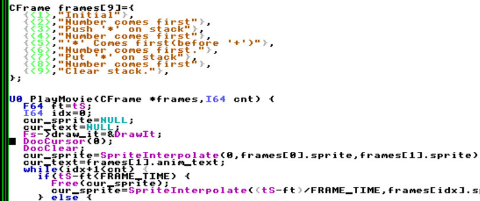
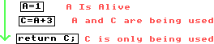
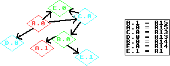

# Devloper Manual (WIP)
This is intended for developes working on the C side,it is intended to be a companion to the source code,not a replacment for reading it.

# Aiwnios Lexer
## What is a Lexer
A Lexer turns the source code into **tokens**. Tokens are like the atoms of source code. They are things like variable names,numbers,strings and characters. For example,the following source code 
```
if 123:
	"Hello World"
```
will be turned into these tokens:
|Token|Type|Value|
|----|----|----|
|if|TK_NAME|"if"|
|123|TK_I64|123|
|:|':'|*None*|
|"Hello World"|TK_STR|"Hello World"|
## Making a Lexer
To Lex some source code,we need a way of having text,so we will need to define some structures. Let's start with a block of text
```c
// This represents a peice of text being lexed(it could be a file macro, or such)
typedef struct CLexFile {
  //
  // If we include a file,we put the current file on hold
  // last will point to the "old" file we are in
  //
  struct CLexFile *last;
  
  char *filename, *text;
  int64_t ln, col, pos;
} CLexFile;
```
In our Compiler,we will handle 1 token at a time. The token will be stored in cur_tok. The values will also be stored in the `CLexer` struct too.
```c
typedef struct {
  CLexFile *file;
  //
  // These are our lexer values,I put them in a union to save memory 
  //
  int64_t str_len;
  union {
    int64_t integer;
    double flt;
    char string[STR_LEN];
  };
  //
  // Sometimes we are lexing and want to go back a charactor
  // LEXF_USE_LAST_CHAR allows us to simulate this.
  //
#define LEXF_USE_LAST_CHAR 1
#define LEXF_ERROR 2
#define LEXF_NO_EXPAND 4 //Don't expand macros
  int64_t flags, cur_char;
  int64_t cur_tok;
} CLexer;
```
We want to have token types. In my sexy compiler I use *ASCII* charactors for small  tokens,**therefore all "big" tokens get stored above the ASCII range(0x100)** 
```c
enum {
  TK_I64 = 0x100,
  TK_F64,
  TK_NAME,
  //... See lex.c
  TK_KW_NOARGPOP,
};
```

It is useful to keep track of our file position while lexing for diagnostics. So whenever we advance a character,so increase `CLexer.pos`,and update `CLexer.col` and `CLexer.ln`. 

Also,remember eariler when I said it is sometimes useful to "go back a character". I simulate this via the `LEXF_USE_LAST_CHAR` flag. We also always store the last character in `Clexer.cur_char` . So let's rock
```c
int64_t LexAdvChr(CLexer *lex) {
  //
  //We want to simulate going back a charactor some times. Say we get a '.'
  // It could mean a '.',a '...' or maybe even a TK_F64.so if one of these fails,
  // we can go back in time and check the next item 
  //
  if (lex->flags & LEXF_USE_LAST_CHAR) {
    lex->flags &= ~LEXF_USE_LAST_CHAR;
    return lex->cur_char;
  }
enter:;
  CLexFile *file = lex->file, *last;
  int64_t ret;
  if (!lex->file)
    return 0;
  //We terminate the silly sauces with 0 as per ASCII nul character
  if (ret = lex->file->text[lex->file->pos]) {
    lex->file->pos++;
    if (ret == '\n')
      lex->file->ln++, lex->file->col = 0;
    else
      lex->file->col++;
    return lex->cur_char = ret;
  } else {
    //Free all the assets of the previous file 
    last = file->last;
    A_FREE(file->text);
    A_FREE(file->filename);
    A_FREE(file);
    //
    // last points to the last file we were in
    // /*Contexts if file.HC */
    // #include "a.HC" // lex->file->next is NULL
    //
    // /*Contexts of a.HC*/
    // "I like toads"; // lex->file->next is "file.HC"'s CLexFile 
    lex->file = last;
    goto enter;
  }
}
```
### Starting our Lexer
Our lexer will take characters  are turn them into tokens,so it makes sense that our skeleton will look like a switch statement
```c
int64_t Lex(CLexer *lex) {
re_enter:;
  int64_t chr1 = LexAdvChr(lex), chr2;
  int64_t has_base = 0, base = 10, integer = 0, decimal = 0, exponet = 0,
          zeros = 0, idx = 0, old_flags, in_else;
  FILE *f;
  char macro_name[STR_LEN];
  CHashDefineStr *define;
  CLexFile *new_file;
  switch (chr1) 
  case ' ':
  case '\t':
  case '\n':
    //We "re_enter" the function to skip whitespace
    goto re_enter;
    break;
  case '0' ... '9':
    //
    // Lex a number code goes here
    // ...
    // ...
    //
    return lex->cur_tok = TK_I64;
    break;
  //
  // Account for more token types
  // ... 
  // ...
  //
  case 0:
    return lex->cur_tok = 0;
  }
  LexErr(lex, "Unexpected charactor '%c'.", chr1);
  return lex->cur_tok = ERR;
}
```
As you can we,we take a character and we do something with it. So let's begin with filling in our (integer) number parsing code.
### Lexing a Integer
What is a digit??? You may be wondering why I'm asking this,but I will explain. But first let's look at the properties of a (base-10) digit:
```c
1234;
``` 
The pattern is that each digit increases by a power of 10. So to get out digits value,we do:
```c
Value=digit*Pow(base,idx);
```
Hence our pattern we see looks like this:
|Digit|Place|Formula|Final|
|---|---|---|---|
|4|0|4*pow(10,0)|4|
|3|1|3*pow(10,1)|3|
|2|2|2*pow(10,2)|2|
|1|3|1*pow(10,3)|1|

`Pow`ing is an expensive operation,but we can simulate a `Pow` by multiplying the final value by  10 each time we get a digit and adding our digit. Let's try it again:
```c
Value=0;
Value*=10;
Value+=1; //Value==1
Value*=10;
Value+=2; //Value==12
Value*=10;
Value+=3; //Value=123
Value*=10;
Value+=4; //Value=1234
```
Before we put this into a function,let's think what happens if instead of 10 digits,we have 16. This is called a hexadecimal. The extra 6 digits are `ABCDEF`. So we would represent `0x101`  like this
|Digit|Place|Formula|Final|
|---|---|---|---|
|1|0|1*pow(16,0)|1|
|0|1|3*pow(16,1)|0|
|1|2|1*pow(16,2)|256|
(This is useful as each hex digit is exactly 4 bits but more on this latter).
Let's Lex:
```c
static int64_t LexInt(CLexer *lex, int64_t base) {
  int64_t chr1;
  int64_t ret = 0, digit;
  while (chr1 = LexAdvChr(lex)) {
    switch (chr1) {
      break;
    case '0' ... '9':
      digit = chr1 - '0';
      break;
    case 'A' ... 'F':
      digit = chr1 - 'A' + 10;
      break;
    case 'a' ... 'f':
      digit = chr1 - 'a' + 10;
      break;
    default:
      //
      // We consumed the current charactor,which may not be useful now,
      // but it may be useful latter.
      //
      lex->flags |= LEXF_USE_LAST_CHAR;
      return ret;
    }
    if (digit >= base)
      goto err;
    //This when repeated "add"s an empty digit,as each digit is a multipl of base
    ret *= base;
    ret += digit;
  }
  return ret;
}
```
Before we can put this in our lexer body,we will need to check for *binary* or *hexadecimal* bases. 
```c
  case '0' ... '9':
    if (chr1 == '0') {
      chr2 = LexAdvChr(lex);
      switch (chr2) {
        break;
      case 'x':
      case 'X':
        chr1 = LexAdvChr(lex);
        base = 16;
        lex->flags |= LEXF_USE_LAST_CHAR;
        break;
      case 'b':
        chr1 = LexAdvChr(lex);
        base = 2;
        lex->flags |= LEXF_USE_LAST_CHAR;
        break;
      case '0' ... '9':
        lex->flags |= LEXF_USE_LAST_CHAR;
        break;
      default:;
        lex->flags |= LEXF_USE_LAST_CHAR;
        //We found a charctor but we didnt use it so put it back
      } else 
	      //
	      // We checked the first digit and checked for 0.
	      // Use it again in LexInt as we found no use for it here.
	      //
	      lex->flags |= LEXF_USE_LAST_CHAR;
      integer = LexInt(lex, base);
      if (integer == ERR && (lex->flags & LEXF_ERROR))
        return lex->cur_tok = ERR;
	  //
	  // Check for 'e','E',or '.' and if we do find it,do some floating 
	  // point math.
	  //
	  // See "Lex a Floating point"
      return lex->cur_tok = TK_I64;
    break;
```
### Lex a Floating-Point
Parsing floating point's are much like parsing integers,but they contain 2 extra peices of data
 - The decimal 
 - The exponet
We can parse the exponet and the decimal much the same way,but because we have an exponet,we can start with that when we find a 'E'/'e' after we find an integer
```c
      //
      // Do this after we Lex an integer
      //
      switch (LexAdvChr(lex)) {
        break;
      case 'E':
      case 'e':
        decimal = 0;
        if (base != 10) {
          LexErr(lex, "Expected a base 10 number for floating points.");
          return lex->cur_tok = ERR;
        }
```
In HolyC,Floating points can look like `123e10`,`123e+10`,`123e-10`. I will use base to hold the multpiler
```c
      exponet:
        exponet=0;
        base=1; //Holds the exponet multiplier
        if('+'==(chr1=LexAdvChr(lex))) {
        } else if('-'==chr1) {
          base=-1;
        } else if(isdigit(chr1))
          goto eloop;
        exponet=LexInt(lex,10);
        exponet*=base;
        lex->flags|=LEXF_USE_LAST_CHAR;
        if (integer == ERR && (lex->flags & LEXF_ERROR)) {
          LexErr(lex, "Expected an exponet.");
          return lex->cur_tok = ERR;
        }
        goto fin_f64;
```
When he encounter a '.',we may have leading zeros so we should track of these as `123.004` is different than `123.4`. Every time we get a zero we increment `zeros` to signify this
```c
      case '.':
      decimal_chk:
        switch (chr1 = LexAdvChr(lex)) {
          break;
        case '0':
          zeros++;
          goto decimal_chk;
          break;
        case '1' ... '9':
          lex->flags|=LEXF_USE_LAST_CHAR;
          decimal = LexInt(lex,10);
          lex->flags|=LEXF_USE_LAST_CHAR;
          break;
        default:;
        }
        if (lex->cur_char == 'e' || lex->cur_char == 'E') {
          lex->flags&=~LEXF_USE_LAST_CHAR;
          goto exponet;
        }
        goto fin_f64;
```

Time to get lit and put it all together . But before we can do this is would be helpful to know how to put turn the integer value `decimal` into a floating point decimal. What we want to do is move the number `zeros` digits begind the '.' of the number.

To do this we need the digit count of decimal to put it (fully) after the '.' . To do this we use a logarithm. A logirithm is the opposite of power,so it we get a logarithm of a number,it will return a number larger than the digit count(including 0 as a digit so we add 1 to the digit count). 
|Number|Log10|floor(Log10(n))+1|
|--|--|--|
|123|2.08990511144|3|
|100|2|3|
|1234|3.0913151597|4|
|1|0|1|

As you can see,`floor`ing will chop off the decimal point and we can add 1 to get the number of digits!!!

What we need to do now is divide this by `1+digits+zero` digits.(which involves using a pow). So our final code is:
```c
fin_f64:
        if (decimal) {
          lex->flt =
              integer + decimal * pow(10, -zeros - 1 - floor(log10(decimal)));
        } else
          lex->flt = integer;
        lex->flt *= pow(10, exponet);
        return lex->cur_tok = TK_F64;
        break;
```
### Taking a Breather,Lexing words(and Macros).
Lexing words is pretty straightforward. We find a word character then we add it to `CLexer.string`.
```c
  case '_':
  case '@':
  case 'a' ... 'z':
  case 'A' ... 'Z':
    lex->flags |= LEXF_USE_LAST_CHAR;
    for (;;) {
      switch (chr1 = LexAdvChr(lex)) {
        break;
      case '_':
      case '@':
      case 'a' ... 'z':
      case 'A' ... 'Z':
      case '0' ... '9':
        if (idx + 1 >= STR_LEN) {
          LexErr(lex, "Name is too long.");
          return lex->cur_tok = ERR;
        }
        lex->string[idx++] = chr1;
        break;
      default:
        lex->flags |= LEXF_USE_LAST_CHAR;
        lex->string[idx++] = 0;
```

 **However**,if we find a macro name(will be explained later),we should expand it if `LEXF_NO_EXPAND` in `CLexer.flags` is not set. When we find a macro,we can add it's text into a  `CLexFile` and lex it as if it just written in source code.

```c
      if (!(lex->flags & LEXF_NO_EXPAND)) {
          define = HashFind(lex->string, Fs->hash_table, HTT_DEFINE_STR, 1);
          if (define) {
            new_file = A_MALLOC(sizeof(CLexFile), NULL);
            new_file->last = lex->file;
            new_file->filename = A_STRDUP(define->data, NULL);
            new_file->pos = new_file->col = new_file->ln = 0;
            new_file->text=A_STRDUP(define->data);
            lex->file = new_file;
            goto re_enter;
          }
        }
        //If we didnt find a macro it's a name
        return lex->cur_tok = TK_NAME;
      }
    }
    break;
```

We will need to lex a `#define` statement to use macros.
```c
  case '#':
  if (TK_NAME == Lex(lex)) {
    //
    // Other preprocessor directives ...
    //
    if(!strcmp(lex->strng,"define")) {
```
Let's set the `LEXF_NO_EXPAND` flag to avoid expanding the macro name(which would prevent us from redefining macros)
```c
        lex->flags|=LEXF_NO_EXPAND;
        if (TK_NAME != Lex(lex)) {
          LexErr(lex, "Expected a name for #define.");
          return lex->cur_tok = ERR;
        }
        //Reset the LEXF_NO_EXPAND bit
        lex->flags&=~LEXF_NO_EXPAND;
```
Let's allocate our macro
```c
        strcpy(macro_name, lex->string);
        strcpy(lex->string, "");
        define = A_CALLOC(sizeof(CHashDefineStr), NULL);
        define->base.str = A_STRDUP(macro_name, NULL);
        define->base.type = HTT_DEFINE_STR;
        define->src_link = LexSrcLink(lex, NULL);
```
While we get the characters for the macro,we may come across comments or a `\` character. We want to ignore the comments and the `\` character will make the comment span another line .
```c
        idx = 0;
        while (chr1 = LexAdvChr(lex)) {
          switch (chr1) {
            break;
          //
          // When we get a '/',it could mean a singleline comment,a multiline-comment,or even just a slash
          // So check for all orf these conditions
          //
          case '/':
            if ('/' == (chr1 = LexAdvChr(lex))) {
              //Is a single line macro
              LexSkipTillNewLine(lex);
            add_macro:
              lex->string[idx++] = 0; 
              define->data = A_STRDUP(lex->string, NULL);
              HashAdd(&define->base, Fs->hash_table);
              // Lex next item
              goto re_enter;
            } else if (chr1 == '*') { //Is a multiline comment
              LexSkipMultlineComment(lex);
              goto add_macro;
            } else {
              //Is just a '/',but we didnt use the last character so re-use it
              lex->flags |= LEXF_USE_LAST_CHAR;
              lex->string[idx++] = '/';
            }
            break;
          case '\\':
            //Skip rest of current line
            LexSkipTillNewLine(lex);
            break;
          case '\n':
            goto add_macro;
            break;
          default:
            lex->string[idx++] = chr1;
          }
        }
      }
```
### Taking a Breather Again (Parsing basic operators)
Some tokens are make up of multiple characters. For example `-=`,`--`,`->` all start with `-`. So we start with `-` then check the next character. If nothing useful is found we re-use the character via `LEXF_USE_LAST_CHAR`(but return `-` as we found that before said character). In code it looks like this.
```c
case '-':
    switch (chr1 = LexAdvChr(lex)) {
      break;
    case '-':
      return lex->cur_tok = TK_DEC_DEC;
      break;
    case '>':
      return lex->cur_tok = TK_ARROW;
      break;
    case '=':
      return lex->cur_tok = TK_SUB_EQ;
      break;
    default:
      lex->flags |= LEXF_USE_LAST_CHAR;
      return lex->cur_tok = '-';
    }
    break;
```

### Parsing Strings/Characters
Charactors and strings are peices of text in TempleOS.Both of them share a simular syntax though,hence we will use a `LexString`function for both of them. 
```c
// till is the terminator charactor 
// Returns 0 if good,else returns ERR
static int64_t LexString(CLexer *lex, int64_t till) {
  int64_t idx, chr1, hex;
  for (idx = 0;;) {
    switch (chr1 = LexAdvChr(lex)) {
    case '\\':
      //Escpae sequences here in the acutual source code
      break;
    default:
    ins:
      if (idx + 1 >= STR_LEN) {
        LexErr(lex, "String exceedes STR_LEN chars.");
        return ERR;
      }
      lex->string[idx++] = chr1;
      break;
    case '\'':
    case '"':
      if (till == chr1)
        goto fin;
      goto ins;
    }
  }
fin:
  lex->string[idx++] = 0;
  lex->str_len=idx;
  return 0;
}
```
However **In TempleOS there is a difference between characters and strings.** 
- Charactors have type `U64` 
- Strings have type `U8*`
Considering that in `LexString` we filled the`CLexer.string` with the silly sauce(the string),we will need to turn the string `CLexer.string` into a `uint64_t`(`U64` in TempleOS) for a character.
To do this we load an `uint64_t` from the data address of `CLexer.string`. We can do this in C via `lex->integer = *(uint64_t *)lex->string;`

So in total our string/character-lexing code would be.
```c
  case '"':
    if (ERR == LexString(lex, '"'))
      return lex->cur_tok = ERR;
    return lex->cur_tok = TK_STR;
    break;
  case '\'':
    //Fill All 8 bytes with zeros
    memset(lex->string, 0, 8);
    if (ERR == LexString(lex, '\''))
      return ERR;
    if (strlen(lex->string) > 8) {
      LexErr(lex, "String constant too long!");
      return ERR;
    }
    lex->integer = *(uint64_t *)lex->string;
    return lex->cur_tok = TK_CHR;
    break;
```

### Processor Fun
In TempleOS,there are amazing preprocessor directives that allow you to choose what parts of the code you want to compile.
For example,if you want to check if a macro is define you can do this
```holyc
//Define a macro to tell the compiler we want SOME_FEATURE
#define SOME_FEAUTRE 1
#ifdef SOME_FEATURE
U0 Feature() {
    "I like toads\n";
}
#endif
```
There is also an `#else` statement you can use too.
```holyc
//#define SOME_FEAUTRE 1
#ifdef SOME_FEATURE
U0 Feature() {
    "I like toads\n";
}
#else
"No toads here!!!\n";
#endif
```
So let's check for a macro's existance in code
```c
if (!strcmp(lex->string, "ifdef")) {
        old_flags = lex->flags;
        lex->flags |= LEXF_NO_EXPAND;
        if (TK_NAME != Lex(lex)) {
          LexErr(lex, "Expected a name for #ifdef.");
          return lex->cur_tok = ERR;
        }
        lex->flags = old_flags; //Restore old flags
		//See next section
```

In AIWNIOS(the sexiest compiler that will ever exist once it is completed),I choose to ignore "stray" `#endif` statements because if an `#ifdef` passes,compilation will continue as usual. It isn't until an `#ifdef` fails do I skip code. `#else` will skip code too . So with that being said,let's look at the code
```c
      if (!HashFind(lex->string, Fs->hash_table, HTT_DEFINE_STR, 1)) {
          in_else = 0;
        if_fail:
          idx = 1; 
          //
          // idx is the current nesting level,it increases every time
          // we encounter a #ifdef(and it's freinds)
          //
          // #ifdef A // idx==1
          // #ifdef B // idx==2
          // #ifdef C // idx==2
          // #endif // idx==1
          // #endif // idx==0
          //
        if_fail_loop:
          while ('#' != (chr1 = LexAdvChr(lex))) {
            if (chr1 == 0)
              return lex->cur_tok = 0;
            if (chr1 == ERR)
              return lex->cur_tok = ERR;
          }
          if (TK_NAME != Lex(lex)) {
            LexErr(lex, "Stray '#' in program.");
            return lex->cur_tok = ERR;
          }
          if (!in_else && !strcmp(lex->string, "else")) {
            goto re_enter;
          } else if (!strcmp(lex->string, "endif")) {
            if (!--idx)
              goto re_enter;
          } else if (__IsCondDirective(lex->string)) {
            idx++;
          }
          goto if_fail_loop;
        } else {
        if_pass:;
          //Fall-through
        }
        lex->flags = old_flags;
        goto re_enter;
      }
```

# Aiwnios Parser 
At the heart of the Aiwnios Parser is the **shunting yard algorithm** for parsing math expressions and **recursive descent** for the if statements and such. But before I jump into that we need to get into how the **Intermediate Code** is stored. The Intermediate code is stored in a circular queue in a `CCmpCtrl`. Because this uses reverse polish notation,I  insert the generated `CRPN`s in the `->code_ctrl->ir_code` member.
## Math Parsing
### Math Parsing(shunting yard algorithm)
`ParseExpr` is the key for parsing math expressions. It uses a stack to store the intermediate codes in(in `ic_stk` and `prec_stk`). How it works is it generates **Reverse Polish Notation**. Values like numbers are inserted into the Queue first,then the operators come after. 

For example this expression 
```
(1+2)*3
```
becomes something like this:
```
1 2 + 3 *
```
There is a gaint switch statement in `ParseExpr`. What is does for most things is do something like this
```
      Lex(ccmp->lex);
      if (binop_before) {
        // Unary
        binop_before = 1; // Like a binop as it consumes the right item
        prec         = 0;
        type         = IC_NEG;
      } else {
        prec         = 6;
        binop_before = 1;
        type         = IC_SUB;
      }
``` 
This will tell us the precedence  of the operator and tell us the its precedence and type. There is a varaible called `binop_before` This will tell us that the operator consumes the next part of the expression. For example, **the `-` can be a negative operator or a subtract operator depending on if the previous token "consumes" it or or not**.

At the end of the switch statement is something like this
```
    if (type == IC_PAREN || type == IC_ARRAY_ACC) {
      prec_stk[stk_ptr] = prec;
      ic_stk[stk_ptr++] = type;
    } else {
      for (; stk_ptr;) {
        if (ic_stk[stk_ptr - 1] == IC_PAREN ||
            ic_stk[stk_ptr - 1] == IC_ARRAY_ACC)
          goto fail;
        if (prec_stk[stk_ptr - 1] < prec)
          goto pass;
        if (prec_stk[stk_ptr - 1] <= prec && !IsRightAssoc(ic_stk[stk_ptr - 1]))
          goto pass;
        goto fail;
      pass:
        ic       = A_CALLOC(sizeof(CRPN), NULL);
        ic->type = ic_stk[stk_ptr - 1];
        QueIns(ic, ccmp->code_ctrl->ir_code);
        AssignRawTypeToNode(ccmp, ic);
        if (ic->type == IC_PRE_DEC || ic->type == IC_PRE_INC)
          SetIncAmt(ccmp, ic);
        stk_ptr--;
      }
    fail:
      prec_stk[stk_ptr] = prec;
      ic_stk[stk_ptr++] = type;
    }
```
What this code does is it will push the operators that need to come first(lower precedence) to the stack. (Right associative operators come if they are equal to the current precedence too). Once this is done,we put the new operator on  the stack. (**Parenthesis and Array Accesses are handled separately**)

When we find the end of the expression,we simply put all the operators into the end result.

Here is an illustation:



```
fin:
  while (stk_ptr) {
    ic       = A_CALLOC(sizeof(CRPN), NULL);
    ic->type = ic_stk[stk_ptr - 1];
    QueIns(ic, ccmp->code_ctrl->ir_code);
    AssignRawTypeToNode(ccmp, ic);
    if (ic->type == IC_PRE_DEC || ic->type == IC_PRE_INC)
      SetIncAmt(ccmp, ic);
    stk_ptr--;
  }
```
### Math Parsing 2
Time to get the nitty gritty. All things in HolyC have types assocaited with them,so I use a function to determine the type of a node called `AssignRawTypeToNode`. Because **Reverse Polish Notation** is fundamentally recursive,we can compute the type recursivley and store type to the `CRPN`.

In Aiwnios,there are 2 members related to types,the `->raw_type`,`->ic_dim` and the `->ic_class`. The raw_type is the type used by the code-generator,and the `->ic_class` is the part used by HolyC.

If you look closely at `ParseExpr`,you will see `SetIncAmt`(Used with `++` and `--` operators) which will use the class type to detirmine how many bytes to move the pointer by. Which brings us to our next part...
###  Pointer Arithmetic
Suprisingly,this isnt handled by `parser.c`,its handled by `optpass.c` in `OptPassExpandPtrs`.  Let's look at the entry for `IC_ADD`
```
     if (a->ic_class->ptr_star_cnt || a->ic_dim) {
        new       = A_CALLOC(sizeof(CRPN), cctrl->hc);
        new->type = IC_MUL;
        QueIns(new, b->base.last);
        lit          = A_CALLOC(sizeof(CRPN), cctrl->hc);
        lit->type    = IC_I64;
        lit->integer = PtrWidthOfRPN(a);
        QueIns(lit, new);
        AssignRawTypeToNode(cctrl, new);
      } else if ((b->ic_class->ptr_star_cnt || b->ic_dim) &&
                 rpn->type != IC_ADD_EQ) {
        new       = A_CALLOC(sizeof(CRPN), cctrl->hc);
        new->type = IC_MUL;
        QueIns(new, a->base.last);
        lit          = A_CALLOC(sizeof(CRPN), cctrl->hc);
        lit->type    = IC_I64;
        lit->integer = PtrWidthOfRPN(b);
        QueIns(lit, new);
        AssignRawTypeToNode(cctrl, new);
      }
```
We first check the `->ptr_star_cnt` member of `CHashClass`. This is the number of pointer stars on the member. Once we find the the width of the pointer using `PtrWidthOfRPN`. We multiply the offset by the width of the pointer **by inserting the multiply expression before the offset `CRPN` beacause this is REVERSE POLISH NOTATION** .

For example if we have the expression
```
I64 *a,b;
a+b;
```
It would be turned into a `CRPN` looking like this
```
+ a b
```
So our code would turn it into:
```
+ a * 8 b
```
## Types
### Whats in a `CHashClass`
In Aiwnios,when we allocate a `CHashClass`,we actually allocate 6 `CHashClass`es as an array. **The additional elements are used for pointer types of the class**. Our `PrsNewClass` looks like this
```
CHashClass *PrsClassNew() {
  int64_t     idx2 = 0;
  CHashClass *cls  = A_CALLOC((STAR_CNT + 1) * sizeof(CHashClass), NULL);
  for (idx2 = 0; idx2 != STAR_CNT; idx2++) {
    cls[idx2].base.str     = NULL;
    cls[idx2].raw_type     = RT_PTR;
    cls[idx2].ptr_star_cnt = idx2;
    if (idx2)
      cls[idx2].sz = 8;
    cls[idx2].use_cnt++;
  }
  return cls;
}
```
A `CHashClass` has a linked list of members to use in the `->members_lst` member. This member has things like the `member_class` and `dim` member.
### Functions are Classes Too
In TempleOS and Aiwnios,Functions have a base type of `CHashClass`. (In Aiwnios's C side ,its accessible from the `->base` member of `CHashFun`). When a class is used as a function,the `->reg` member stores the current register of the member,or `REG_NONE` is none is assigned. The flags are `MLF_DFT_AVAILABLE` is used with function arguments to tell if a argument has a default value(stored in `->dft_val` or `->dft_val_flt`). Static members have the flag `MLF_DFT_AVAILABLE` set.

## Parsing Everything Else
If you look at `parser.c` it may look look overwhelming,but it's actually quite easy. The parser has a function for parsing things like `goto` statement,`if` statements and more. The easiest one of these is `ParseScope` and it's source is here
```
int64_t PrsScope(CCmpCtrl *ccmp) {
  CRPN   *ic, *old, *cur;
  int64_t old_cnt;
  if (ccmp->lex->cur_tok == '{') {
    old = ccmp->code_ctrl->ir_code->next;
    Lex(ccmp->lex);
    while (ccmp->lex->cur_tok != '}') {
      if (!PrsStmt(ccmp)) {
        ParseErr(ccmp, "Expected an expression.");
        return 0;
      }
    }
    Lex(ccmp->lex);
    return 1;
  }
  return 0;
}
``` 
This function will call `PrsStmt` which calls things like `PrrsGoto` and such. It can even call `PrsScope` for nested scopes. This is called **Recursive Descent** as each time we find something,we recurse into it.
### Storing misc data
In Aiwnios,sometimes we need miscellaneous data for things like strings,label or jump-tables. To do this I use `CCodeMisc`s. To use a `CCodeMisc` use `CodeMiscNew(CCmpCtrtl*,int64_t type)`. Here is an example of making a string `CCodeMisc`
```c
    case TK_STR:
      binop_before = 0;
      string       = PrsString(ccmp, &str_len);
      ic           = A_CALLOC(sizeof(CRPN), NULL);
      QueInit(&ic->base);
      ic->type = IC_STR;
      for (misc = ccmp->code_ctrl->code_misc->next;
           ccmp->code_ctrl->code_misc != misc; misc = misc->base.next) {
        if (misc->type == CMT_STRING)
          if (misc->str_len == ccmp->lex->str_len)
            if (0 == memcmp(misc->str, string, str_len)) {
              ic->code_misc = misc;
              goto found_str;
            }
      }
      misc          = CodeMiscNew(ccmp, CMT_STRING);
      misc->str_len = str_len;
      misc->str     = string;
      ic->code_misc = misc;
    found_str:
      QueIns(ic, ccmp->code_ctrl->ir_code);
      goto next;
```
If you read the example(for parsing a string),you will see that we create the `CCodeMisc`. The string length is stored in `->str_len` and the string is stored in `->str`.

## Intermediate Code Reference

| Intermediate Code | Arguments | Meaning|
|--|--|--|
| IC_GOTO | () | `->code_misc` points to a label to go to|
| IC_GOTO_IF | (condition) | `->code_misc` points to a label to go to|
| IC_TO_F64 | (expr) | Converts expression to a `F64`|
| IC_TO_I64 | (expr) | Converts an expression to a `I64` |
| IC_LABEL | () | `->code_misc` points to a label to set the addres of|
|IC_STATIC|()| `->integer` is an offset from the statics area for a pointer|
|IC_LOCAL|()|`->local_mem` points to a member of the current function. |
|IC_GLOBAL|()|`->global_var` points to a function or a global variable |
|IC_NOP|()|Pushing P, this doesn't do anything|
|IC_NEG|(expr)|This is the negative of an expression|
|IC_POS|(expr)|Pushing P,this doesn't do anything|
|IC_STR|()|This takes a `->code_misc` of the string|
|IC_CHR|()|This is a charactor literal(`->integer`is the charactor)|
|IC_POW|(exp,base)|This is a power-of operator|
|IC_ADD|(b,a)|This adds numbers|
|IC_EQ|(src,dst)|This assigns a value|
|IC_SUB|(b,a)|This subtracts 2 values|
|IC_DIV|(b,a)|This divides 2 values|
|IC_MUL|(b,a)|This multiples 2 values|
|IC_DEREF|(ptr)|This dereferences a pointer|
|IC_AND|(b,a)|This does a bitwise AND|
|IC_ADDR_OF|(var)|This gets the address of an item|
|IC_XOR|(b,a)|This does a bitwise XOR|
|IC_MOD|(b,a)|This computes the remainder of a 2 values|
|IC_OR|(b,a)|This computes a bitwise OR|
|IC_LT|(b,a)|This computes a less-than operation|
|IC_GT|(b,a)|This computes a greater-than operation|
|IC_LNOT|(a)|This is a logical NOT operation|
|IC_BNOT|(a)|This is a binary NOT operation|
|IC_POST_INC|(a)|The increases the value by `->integer` amount|
|IC_POST_DEC|(a)|The decreases the value by `->integer` amount|
|IC_PRE_INC|(a)|The increases the value by `->integer` amount|
|IC_PRE_DEC|(a)|The decreases the value by `->integer` amount|
|IC_AND_AND|(b,a)|This does a logical AND operation|
|IC_OR_OR|(b,a)|This does a logical OR operation|
|IC_XOR_XOR|(b,a)|This does a logical XOR operation|
|IC_EQ_EQ|(b,a)|This checks if 2 values are equal|
|IC_NE|(b,a)|These computes if 2 values are not equal|
|IC_LE|(b,a)|This computes a less-than-or-equal operation|
|IC_GE|(b,a)|This computes a greater-than-or-equal operation|
|IC_LSH|(b,a)|This shifts `b` left by `a` bits|
|IC_RSH|(b,a)|This shifts `b` right by `a` bits|
|IC_ADD_EQ|(b,a)|This does an add-assign|
|IC_SUB_EQ|(b,a)|This does a subtract-assign|
|IC_MUL_EQ|(b,a)|This does a multiply-assign|
|IC_DIV_EQ|(b,a)|This does a divide-assign|
|IC_LSH_EQ|(b,a)|This does a left-shift-assign|
|IC_RSH_EQ|(b,a)|This does a right-shift-assign|
|IC_AND_EQ|(b,a)|This does a AND-assign|
|IC_OR_EQ|(b,a)|This does a OR-assign|
|IC_XOR_EQ|(b,a)|This does a XOR-assign|
|IC_MOD_EQ|(b,a)|This does a remainder-assign|
|IC_I64|()|This is a integer literal(value stored in `->integer`)
|IC_F64|()|This is a floating point literal(value stored in `->flt`)
|IC_RET|(return_value)|This will return from a function
|IC_CALL|(function,args...)|This will call a function
|IC_COMMA|(b,a)|This will do both `b` and `a`,returning `a`'s value
|IC_UNBOUNDED_SWITCH|(expr)|This does a unbounded switch(table is in `->code_misc`)|
|IC_BOUNDED_SWITCH|(expr)|This does a normal switch(table is in `->code_misc`)|
|IC_SUB_PROLOG|()|This starts a sub-routine|
|IC_SUB_CALL|()|This calls a sub-routine(`->code_misc` points to a label with a IC_SUB_PROLOG)|
|IC_SUB_END|()|This ends a sub-routine|
|IC_TYPECAST|(expr)|This does a bit-for-bit typecast based on the type of the IC_TYPECAST `CRPN`|
|IC_BASE_PTR|()|This is used by optpass for variables not stored in registers(offset from base pointer is in `->integer`)|
|IC_IREG|()|This is an integer register(`->integer` is the register number)|
|IC_FREG|()|This is an floating point register(`->integer` is the register number)|
|__IC_VARGS|(args)|This is used by the HolyC side to make vargs(`->length` is arg count)|
|__IC_ARG|(dst)|This is used by the HolyC to load an argument into a value|
|__IC_SET_FRAME_SIZE|()|This is used by the HolyC side to set the frame size(`->integer` is the frame size)|
|IC_RELOC|()|This gets the address of a symbol's relocation(`->code_misc` has a type of `CMT_RELOC_U64`)|
|__IC_CALL|(function,args...)|This calls a function,used by HolyC side|
|__IC_STATICS_SIZE|()|This sets the size of the static data area,used by the HolyC side|
|__IC_STATIC_REF|()|This is a value in the static data area,used by the HolyC side|
|__IC_SET_STATIC_DATA|()|Sets the data in the static data area,(`->code_misc` has a type of `CMT_STATIC_DATA`)|
|IC_SHORT_ADDR|()|Like an IC_RELOC,but the address is short|
|IC_RAW_BYTES|()|This stores raw bytes into the code(`->len` and `->raw_types` will tell you what the raw bytes are)|
|IC_GET_VARGS_PTR|(dst)|This gets the vargs poinnter and stored it in dst|

## Sexy Register Allocator

### Live Variable Analysis
  The register allocator works by first doing [live variable analysis](https://en.wikipedia.org/wiki/Live-variable_analysis). This means it detirmines where the varaibles are being used or not being used:


 
  How I do this is I is I first mark which registers we use or kill(kill the old value by assigning into it),see `CRPN->use_regs` and `CRPN->kil_regs`.

  Then I construct a control flow graph with the `CRPN->user_data` and `CRPN->user_data2` being the outgoing and incoming `CRPN`s. Each node inherits its successors' live registers.
### Graph Coloring
  I use a graph alogirthm called graph coloring. This means I create an "interference graph" then make sure each register in the graph is not a adjacent to another register that is alive at the same time(so no register conflicts).

  This allows registers to be re-used for other varaibles to make the code sexier.


 
 ### Sexy Number Renumbering
   Using the variables in a graph may get very crowded. To do this,I seperate the variables into "sub-variables" in GenerateRenumbersForVar. I call these sub-variables "numbers" as I name the "var.1" or "var.2" etc.

  To do this I first find the groups of nodes connected by a variable's being alive(InfectAdjacent). Once I find the groups I create psuedo-members.

  Consider this graph,say we only have 3 registers to use,E cannot be stuffed in a register as we dont have enough registers for it.


 
  We can make more room by dividing our register usage into numbered sections
  


