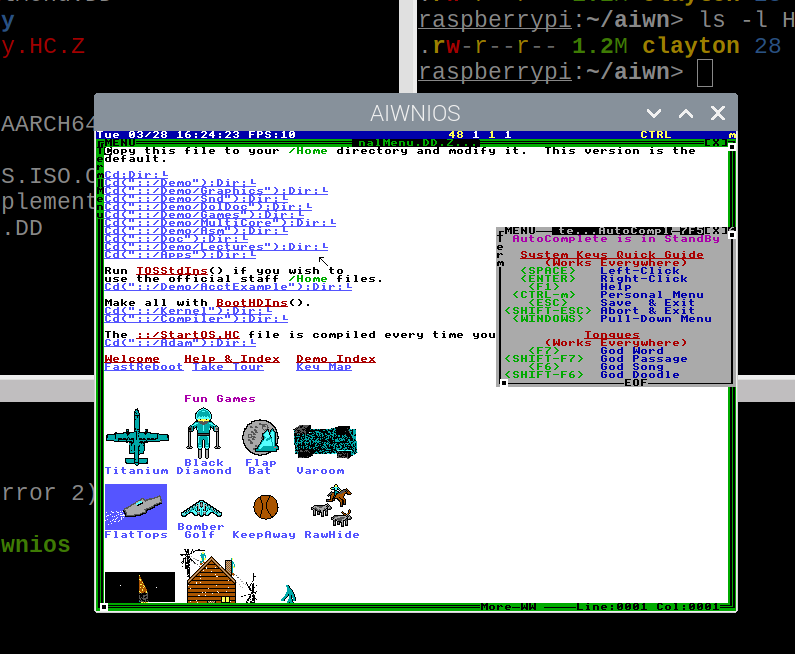
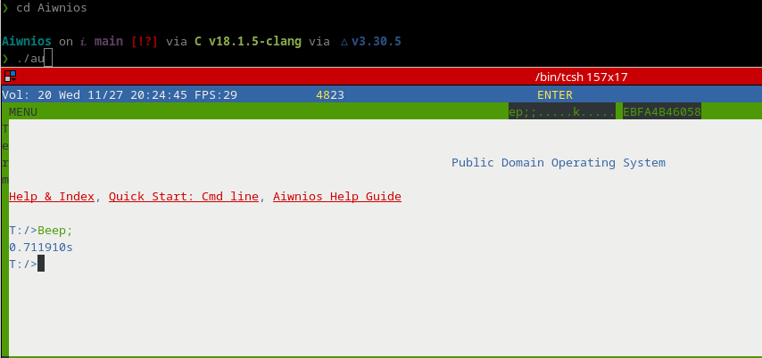

# Welcome to Aiwnios

This is a HolyC Compiler/Runtime written for 64bit x86, aarch64 (includes ***MacOS***) and RISC-V
machines,although other architectures are planned for the future. This project is largely complete (aside from adding support for other architectures) so stay tuned.

## Support table

| Architecture | OS |
|--|--|
| x86_64 | Windows, Linux and FreeBSD |
| aarch64 | Linux, FreeBSD and ***MacOS*** |
| rv64 (RISC-V 64) | Linux |

## Screenshot
<div align="center">
    
</div> <!-- whoever did the <center> was retarded, thats HTML3 (!) and only applies to text -->

## Building Aiwnios

### FreeBSD/Linux

I develop on a lot of computers. For ARM I use an Apple M1 MacBook(MacOS x Asahi Linux). For RISC-V I use a [LicheePi4](https://wiki.sipeed.com/hardware/en/lichee/th1520/lpi4a/2_unbox.html). Make sure you buy one Trump imposes tariffs on sexy RISCV machines(I also test on a [StarFive VisionFive 2](https://www.starfivetech.com/en/site/boards)). For X86_64 I use alot of old and new machines.

To build Aiwnios, you will need a C compiler, SDL2 development libraries and headers, and cmake. LTO with Clang/lld is supported if you like something saucy.

Build with the following after cloning:

```sh
# Build aiwnios
mkdir build;cd build;
cmake ..;
make -j$(nproc);
cd ..;

#Bootstrap the HCRT2.BIN to run it
./aiwnios -b;

#Run the HCRT2.BIN
./aiwnios; # Use -g or --grab-focus to grab the keyboard, -h for more options
```

If you want to create a cool package for your system, you can use [CPack](https://cmake.org/cmake/help/book/mastering-cmake/chapter/Packaging%20With%20CPack.html). Ill probably do this for you. The `cpack` is tested on Windows(NSIS). If you want to generate a FreeBSD `.pkg`,you'll need build cmake from source of FreeBSD because cpack has *experimental*  support for FreeBSD. Make sure you enable it.

### Windows 10/11

1. Install [msys2](https://msys2.org)
2. Run "MSYS2 MINGW64" (***MUST*** BE MINGW64)
3. `pacman -Sy git mingw-w64-x86_64-{gcc,SDL2,cmake}`
4. Clone this repository
5. Run the following after navigating to the directory
```
mkdir build
cd build
cmake ..
ninja
cd ..
```
5. You will see the `aiwnios` binary in the directory

### Windows 7

1. Download [WinLibs](https://winlibs.com/) and add to PATH: Make sure the mingw32/bin or mingw64/bin folder from the extracted download is in your PATH and its location doesn't contain any spaces
2. Download and extract devel mingw [SDL2](https://github.com/libsdl-org/SDL/releases)
3. Clone this repository and navigate to it
```
mkdir build
cd build
cmake -DSDL2_DIR=C:\Path\To\SDL2-devel-2.32.0-mingw\SDL2-2.32.0\x86_64-w64-mingw32\lib\cmake\SDL2 ..
ninja
cd ..
```
4. You will see the `aiwnios` binary in the directory

### MacOS

Your on your own. Use homebrew to install packages, rest is same as FreeBSD


# TUI Mode

<div align="center">
    
</div> <!-- whoever did the <center> was retarded, thats HTML3 (!) and only applies to text -->

You can use the `--tui` to run a DolDoc enviroment in the terminal. ***Use `ExitAiwnios;` to leave.***

# AiwniosPack

  You can make a standalone exe with an application(on MingW64(not msys unless you want all the libraries)).
  
  It works by appending an HCRT2.BIN and RamDisk at the end of the executable. SDL on windows is statically linked by default.
  
  You will need to include the `Src` and `Doc`(For `/Doc/StandBy.DD` and friends.)  directories in your Aiwnios packages.
  
  Do something like this:

```c
DelTree("Root");
DirMk("Root");
CopyTree("Doc","Root/Doc");
CopyTree("Src","Root/Src");
AiwniosPack("a2.exe","Beep;\n","Root");
```

# Future

I plan on adding something lit like an arm assembler from HolyC.

## Internals

In aiwnios,the secret sauce is in mainly in `*_backend.c`. There you will find the compiler.
I have gutted out the TempleOS expression parsing code and replaced it with calls to `__HC_ICAdd_XXXXX`
 which will be used in `*_backend.c`. There is a super assembler in `*_asm.c` 
 which you can use. Look at `ffi.c` to see how its used.

**THIS COMPILER USES REVERSE POLISH NOTATION**. And statements are reversed too so
the last statement is at `head->base.next` and the first one ends at `head->base.last`.
Email *nrootconauto@gmail.com* for more info(I hear my code is unreadable so I will stop
explaining here). 

## Sockets

Aiwnios comes with a sockets API.

Here is a simple server for you to play with until Nroot documents the Sockets API
```c
U0 Main () {
  U8 buf[STR_LEN];
  I64 fd;
  I64 s=NetSocketNew;
  CNetAddr *addr;
  addr=NetAddrNew("127.0.0.1",8000);
  NetBindIn(s,addr);
  NetListen(s,4);
  while(TRUE) {
    if(-1==NetPollForRead(1,&s)) {
      Sleep(10); 
    } else {
      fd=NetAccept(s,NULL);
      while(-1==NetPollForRead(1,&fd))
        Sleep(10);
      buf[NetRead(fd,buf,STR_LEN)]=0;
      "GOT:%s\n",buf;
      NetClose(fd);
    }
    if(ScanKey)
     break;
  }
  NetClose(s);
  NetAddrDel(addr);
}
Main;
```

## Extending Aiwnios
### Make an IC_intern
```c
_intern IC_SQR F64 Sqr(F64);
``` 
### Add IR_code in aiwn_lexparser.h/parser.c
`aiwn_lexparser.h`
```c
enum {
/*Insert new IR code here */
IC_GOTO,
//...
};
//Later
HC_IC_BINDINGH(HC_ICAdd_Sqr)
```

`parser.c`
```c
//Add this
HC_IC_BINDING(HC_ICAdd_Sqr, IC_SQR);
```
### Add entires for the IR code in frontend and backend

  Add entires in these functions
`parser.c`
```c
CRPN *ICFwd(CRPN *rpn) {
   //...
   case IC_SQR:
	goto unop;
   //...
}
CRPN *ParserDumpIR(CRPN *rpn, int64_t indent) {
	//...
	case IC_SQR:
	printf("`2");
	//...
}
int64_t DolDocDumpIR(char *to, int64_t len, CRPN *rpn) ;
int64_t AssignRawTypeToNode(CCmpCtrl *ccmp, CRPN *rpn) {
	//...
	case IC_SQR:
    AssignRawTypeToNode(ccmp, rpn->base.next);
    //Is a F64,use HashFind
    rpn->ic_class = HashFind("F64", Fs->hash_table, HTT_CLASS, 1);
    return rpn->raw_type = rpn->ic_class->raw_type;
    break;
	//...
}
```

`x86_64_backend.c`
```c
static int64_t SpillsTmpRegs(CRPN *rpn) {
	//...
	case IC_POS:
	case IC_SQR:
	//....
}
static int64_t PushTmpDepthFirst(CCmpCtrl *cctrl, CRPN *r, int64_t spilled) {
	//...
	  case IC_SQR:
    goto unop;

	//...
}
static void SetKeepTmps(CRPN *rpn) {
	//...
	case IC_POS:
	case IC_SQR: //Is a unop
	//... 
}
static int64_t __OptPassFinal(...) {
	case IC_SQR:
	next = ICArgN(rpn, 0);
    code_off = __OptPassFinal(cctrl, next, bin, code_off);
    code_off=PutICArgIntoReg(cctrl,&next->arg,RT_F64,0,bin,code_off); //Fallback to reg 0
    if(rpn->res.mode==MD_REG) {
		AIWNIOS_ADD_CODE(ARM_fmulReg(rpn->res.reg,next->arg.reg,next->arg.reg));
	} else {
		tmp.mode=MD_REG;
		tmp.raw_type=RT_F64;
		tmp.reg=MFR(cctrl,0); //MAKE SURE TO MARK THE VARIABLE AS modified
		AIWNIOS_ADD_CODE(ARM_fmulReg(tmp.reg,rpn->res.reg,next->arg.reg,next->arg.reg));
		code_off=ICMov(cctrl,&rpn->res,&tmp,bin,code_off);//Move tmp into result.
	}
    break;
}
```

`Src/AIWNIOS_CodeGen.HC`
```c
//At Start of file
#ifdef IMPORT_AIWNIOS_SYMS
import U8 *__HC_ICAdd_Sqr(U8 *);
#else
extern  U8 *__HC_ICAdd_Sqr(U8 *);
#endif
U8 *AiwniosCompile(CCmpCtrl *cc,I64 *res_sz=NULL,CDbgInfo **info) {
//...
    case IC_SQR:
	  new=__HC_ICAdd_Sqr(cc2);
	  break;
//...
}
```

`main.c`

```
static int64_t STK___HC_ICAdd_Sqr(int64_t *stk) {
  return (int64_t)__HC_ICAdd_Sqr((CCodeCtrl *)stk[0]);
}
// main()
PrsAddSymbol("__HC_ICAdd_Sqr", STK___HC_ICAdd_Sqr, 1);
```
## Credits

- [argtable3](https://github.com/argtable/argtable3)
- [Cmake architecture detector by axr](https://github.com/axr/solar-cmake/blob/master/TargetArch.cmake)
- [Xbyak Arm assembler](https://github.com/fujitsu/xbyak_aarch64)
- [sdl2-cmake-modules](https://github.com/aminosbh/sdl2-cmake-modules)
- [AArch64-Encodung](https://github.com/CAS-Atlantic/AArch64-Encoding)

---

# Developer manual

If you want something saucier and want to understand the sauce, look at [the developer manual](DEVMAN.MD)
